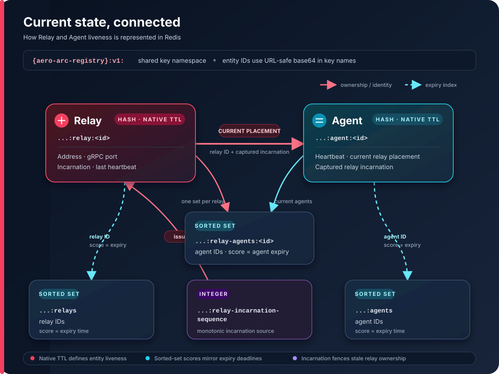

# Redis backend

Redis is the production registry backend. It stores only current control-plane state; it is not a history store.

## Liveness and consistency

- Relay and agent hashes use Redis-native millisecond TTLs. A positive native TTL is part of entity validity; persistent hashes or relay-membership indexes are corrupt state. Registration and heartbeats renew the relevant TTL only after atomically validating the complete entity, ownership relationship, live indexes, and native expiries; corrupt records are rejected and repaired without partial renewal.
- Mutating scripts use Redis `TIME`, so timestamps do not depend on the clock of a particular registry replica.
- A relay registration creates a monotonically increasing Redis-issued incarnation when no live hash exists. Idempotent retries and metadata updates preserve the active incarnation and agent membership. Re-creation after expiry or removal receives a new incarnation; agent registrations capture it, and reads and heartbeats reject surviving hashes from the prior relay instance.
- An agent is live only while both its agent hash and assigned relay hash exist. A relay expiry therefore removes its agents from registry reads immediately, even before the periodic registry sweep runs.
- Agent registration, reassignment, heartbeat, and removal update the entity, placement, and indexes atomically with Lua scripts. Registration validates the relay's complete hash and unexpired global-index membership before writing any agent state; an invalid target is rejected without disturbing an agent's existing placement.
- The Lua transaction programs are maintained as embedded source files under
  `internal/registry/backend/redis/scripts/`. Each file declares the ordered
  Redis `KEYS` and `ARGV` contract consumed by its Go wrapper; the files are
  compiled into the Registry binary and require no runtime filesystem assets.
- Cleanup never executes Redis commands against a membership key merely because an agent hash names it. Scripts derive the canonical registry-owned membership key from a validated relay key and ownership incarnation, and safely repair wrong-type canonical keys without touching arbitrary stored keys.
- Relay-scoped reads repair only the membership belonging to the relay being listed when they encounter an agent that has moved. They never follow the agent's new placement to delete current state, so a stale relay-list snapshot cannot erase a concurrent reassignment.
- Agent heartbeats are ownership-scoped: the caller supplies its relay ID, and Redis renews the agent only when that relay is live and still owns the current placement. A stale relay heartbeat cannot move or extend an agent taken over by another relay.
- Sorted-set indexes carry the same expiry deadline as their entities. Reads prune expired members and ignore hashes that expired between the index and entity reads.
- Listing is deterministic by ID. The backend provides current, eventually consistent state and does not provide historical events or global ordering.

The service-level TTL sweep is disabled for Redis. Redis `TIME` and native key expiry are the sole liveness authority, avoiding incorrect deletions when a registry replica's clock differs from the Redis server. Backends without native TTL support, including the in-memory backend, continue to use the service-level sweep.

## Why Lua

A single Registry operation can span an entity hash, the global expiry index,
the per-relay membership index, native TTLs, and the relay incarnation
sequence. Together those records express one placement and liveness invariant.
Issuing separate Redis commands from Go would allow expiry, heartbeat,
reassignment, or relay re-creation to interleave midway through an operation.
That could expose partial state or let a stale relay renew an agent it no longer
owns.

Redis executes a Lua program atomically on the server. Each Registry script can
therefore validate the current entity, TTL, index membership, relay incarnation,
and expected owner, then update or repair all related keys as one indivisible
operation. The scripts also use Redis `TIME`, which gives every Registry replica
the same timestamp authority, and they avoid the network round trips required by
an equivalent sequence of client-side commands.

`MULTI`/`EXEC` alone cannot branch on values read during the transaction.
`WATCH` could provide optimistic concurrency, but it would require client-side
retry loops and duplicate the conditional validation and repair state machine in
Go. Embedded Lua keeps each atomic state transition with the Redis adapter and
ships it inside the Registry binary, so there is no separate server-side script
deployment.

To keep atomic execution safe and reviewable:

- Lua is limited to Redis storage invariants; API validation and service policy
  remain in Go.
- Scripts operate on a bounded set of keys and do not perform unbounded scans or
  external I/O, because Redis serializes script execution.
- Related keys share the `{aero-arc-registry}` hash tag so every script remains
  within one Redis Cluster hash slot, even though Redis Cluster is not currently
  supported.
- Every script documents its ordered `KEYS` and `ARGV` contract. Its Go wrapper,
  Lua source, and transaction tests must change together.

## Key model

All keys use the versioned `{aero-arc-registry}:v1:` namespace. Entity IDs are URL-safe base64 encoded in key names.

Current Conformance state uses two keys per logical assignment:

- `conformance-summary:<base64url assignment ID>` stores the JSON projection,
  Registry receipt time, and expiry time for the short live-state TTL.
- `conformance-fence:<base64url assignment ID>` stores zero-padded assignment
  generation, evaluation revision, and content digest for the longer fence TTL.

`publish_conformance.lua` compares generation before revision, rejects lower
cursors, treats exact content retries as idempotent, and rejects changed content
at the same cursor. Zero-padded decimal strings avoid Lua floating-point loss
for `uint64` fences. The fence intentionally outlives the projection so expiry
cannot permit stale state resurrection.



The namespace contains a Redis hash tag so related keys share a slot. The current client targets a standalone Redis deployment; Redis Cluster is not yet a supported configuration.

## Failure behavior

Redis and context errors are returned to the gRPC layer. Missing or expired entities map to `registry.ErrNotFound`. Relay, agent, placement, and relay-membership reads validate the complete current entity and ownership relationship in one Lua operation. Incomplete, invalid, unindexed, or old-incarnation records are omitted and repaired instead of failing healthy neighbors. Relay repair removes the corrupt hash, global index entry, and relay-membership index; agent repair removes its hash and index memberships. Repairs and registrations are serialized by Redis, so a repair based on stale state cannot delete a fresh valid write.

## Ownership heartbeat rollout

Deploy the relay-owned heartbeat contract in this order:

1. Merge and publish the protobuf release that adds `relay_id` to `HeartbeatAgentRequest`.
2. Deploy Relay with that protobuf version so every agent heartbeat supplies its relay ID. The older Registry safely ignores the new field.
3. Deploy the strict Registry version, which requires `relay_id` and rejects a heartbeat unless it matches the current live placement.

After step 3, do not roll Relay back independently: an older Relay omits `relay_id`, so the strict Registry rejects its agent heartbeats until Relay is restored or Registry is rolled back as well. Rollbacks must therefore restore Relay first, or roll Relay and Registry back together.

## Tests

Fast unit and concurrency tests use an in-process Redis-compatible server:

```sh
go test ./...
go test -race ./...
```

Run the real Redis integration test with Docker available. Testcontainers starts the pinned `redis:8.8.1-alpine` image on a dynamic host port, waits for readiness, captures logs on failure, and removes the container afterward. If Docker is unavailable, the test skips consistently with the Relay integration harness. Set `REDIS_TEST_ADDR` only to use an externally managed Redis server instead:

```sh
go test -tags=integration ./internal/registry/backend/redis
REDIS_TEST_ADDR=127.0.0.1:6380 go test -tags=integration ./internal/registry/backend/redis
```

The integration test uses a unique namespace and removes its keys when complete. It never binds a fixed Redis port and never flushes the selected Redis database.
